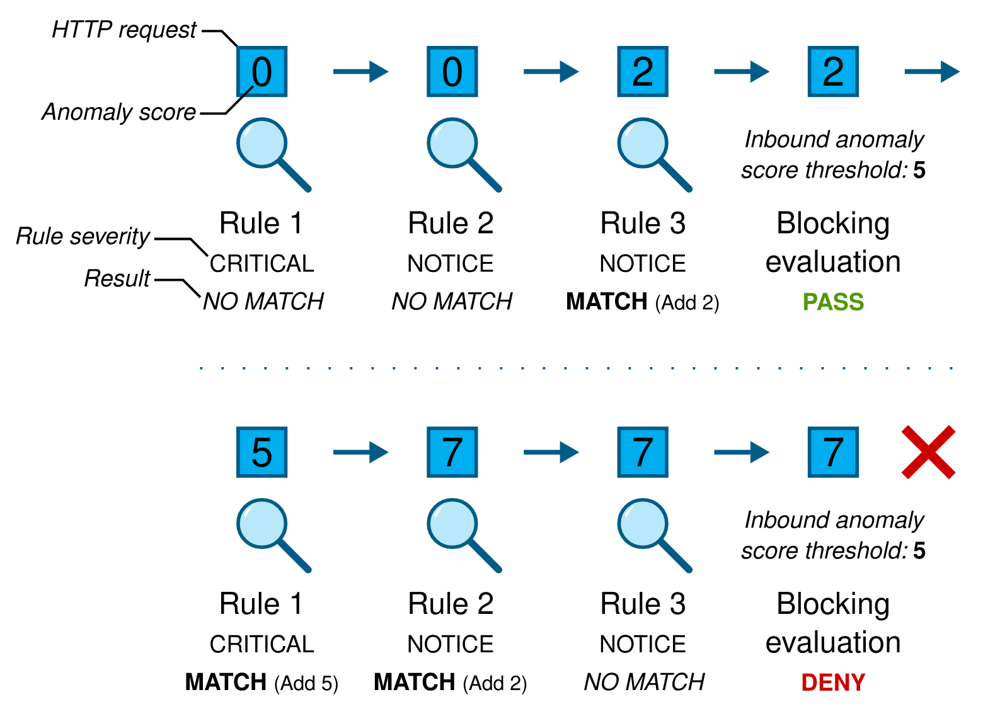
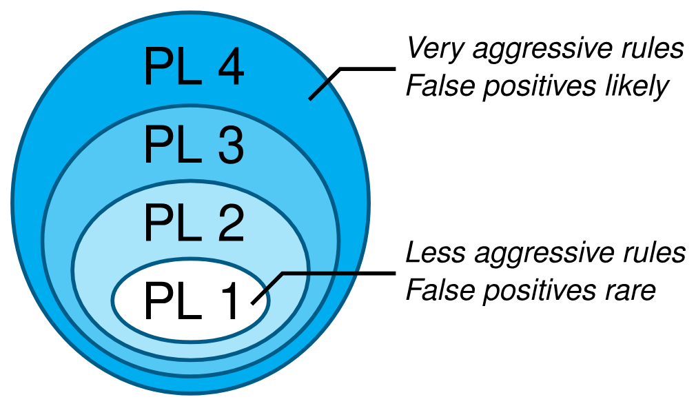
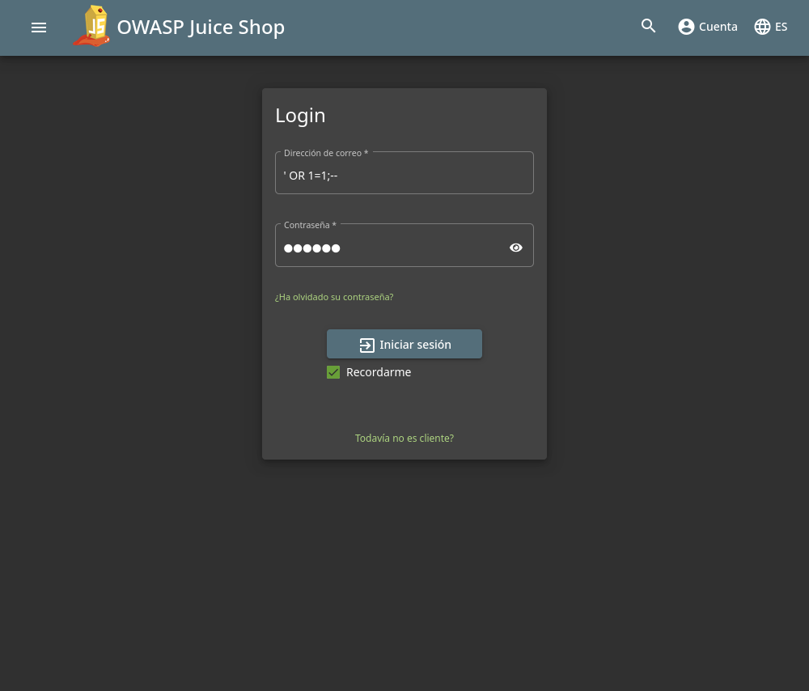
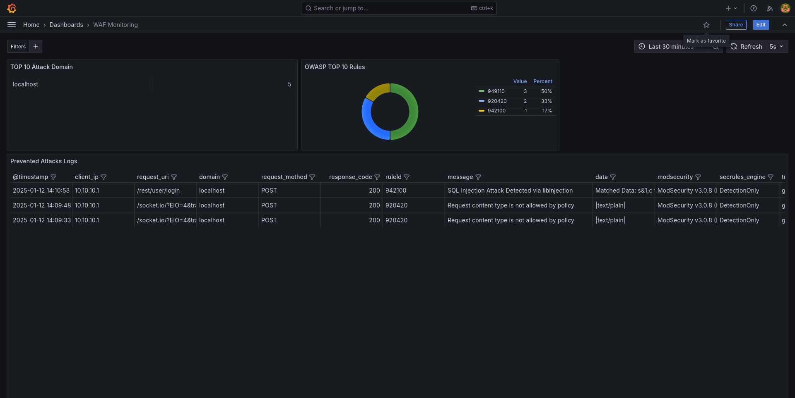
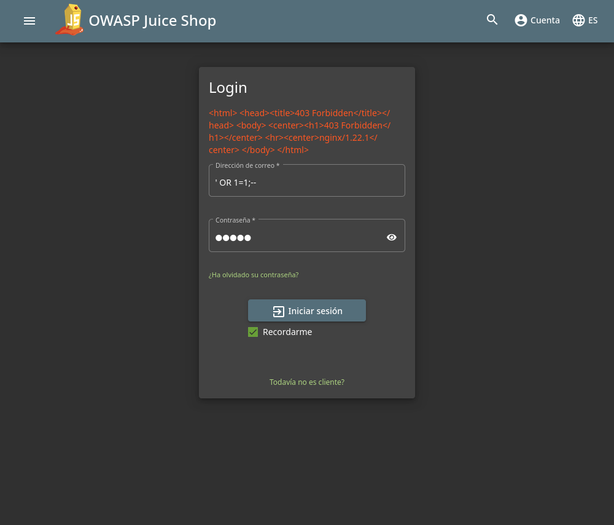
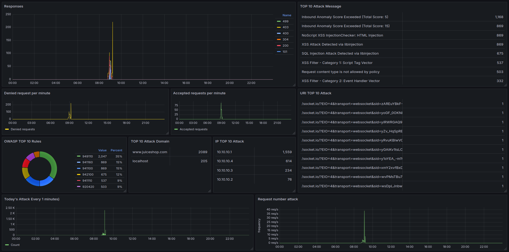

# WAF-101
## ¿Qué es un WAF?  
Un **Web Application Firewall (WAF)** es una herramienta de seguridad diseñada para proteger aplicaciones web al filtrar y monitorear el tráfico HTTP. Los WAFs actúan como una barrera entre los usuarios y las aplicaciones, protegiendo contra ataques como inyecciones SQL, Cross-Site Scripting (XSS) y otros exploits.  

A diferencia de los firewalls tradicionales que operan a nivel de red, los WAFs están diseñados para trabajar en el nivel de la aplicación, analizando el contenido y el contexto de las solicitudes y respuestas HTTP.

### ¿Por qué hemos elegido Nginx y ModSecurity?  
En este laboratorio, hemos optado por utilizar Nginx como servidor web junto con el módulo ModSecurity para implementar el WAF. Esta elección se debe a varias razones:

1. **ModSecurity como biblioteca de reglas:**
ModSecurity es una biblioteca ampliamente utilizada que permite definir y aplicar reglas para filtrar y analizar el tráfico HTTP. Estas reglas pueden ser personalizadas o basarse en conjuntos predefinidos como el [OWASP CRS (Core Rule Set)](https://owasp.org/www-project-modsecurity-core-rule-set/), que protege contra los ataques más comunes descritos en el OWASP Top 10.

2. **Conector oficial para Nginx:**
La organización detrás de ModSecurity también desarrolla un [conector oficial para Nginx](https://github.com/owasp-modsecurity/ModSecurity-nginx), que gestiona la comunicación entre la biblioteca de ModSecurity y el servidor web.

3. **Imagen Docker oficial**:
ModSecurity ofrece una [imagen Docker oficial](https://github.com/coreruleset/modsecurity-crs-docker) que configura directamente Nginx con el OWASP Core Rule Set (CRS). Esto simplifica enormemente el proceso de implementación.

En este laboratorio se ha utilizado la imagen de Docker oficial con el OWASP Core Rule Set (CRS) configurado.

Aunque los **Cloud Service Providers (CSP)** como AWS, Azure o GCP ofrecen soluciones WAF, muchas de estas son de pago, complejas de configurar y carecen de transparencia en cuanto a su funcionamiento interno. Esto puede dificultar la comprensión y el control sobre cómo se aplican las reglas y se gestiona el tráfico. 

Además, la mayoría de los WAF de terceros utilizan ModSecurity como base para implementar sus reglas y capacidades de protección. Esto se debe a que ModSecurity es una biblioteca ampliamente reconocida y flexible para la detección y mitigación de amenazas web. Por lo que en este laboratorio se ha optado por utilizar ModSecurity directamente, ya que proporciona una visión más clara y práctica de cómo funcionan los WAFs en su núcleo.

Sin embargo, es fundamental comprender las limitaciones de ModSecurity frente a otras soluciones WAF más completas. Mientras que ModSecurity es extremadamente eficaz para detectar y mitigar ataques basados en el OWASP Top 10, como inyecciones SQL y Cross-Site Scripting (XSS), no está diseñado para abordar otros tipos de amenazas comunes en el panorama de la ciberseguridad actual, tales como protección contra ataques DDoS, gestión de bots, scraping automatizado o una interfaz gráfica nativa para administrar y visualizar datos.

## ¿Cómo detecta ataques ModSecurity?
### Puntuación de Anomalías
ModSecurity utiliza un enfoque basado en [Anomaly Scoring](https://coreruleset.org/docs/concepts/anomaly_scoring/) (puntuación de anomalías), también conocido como “detección colaborativa”, para identificar posibles ataques. Este mecanismo asigna un puntaje numérico a cada transacción HTTP (solicitudes y respuestas), reflejando qué tan “anómala” parece ser. Este puntaje acumulado se compara con un umbral predefinido para decidir si la transacción debe ser bloqueada o permitida.

Una vez que todas las reglas que inspeccionan los datos de la solicitud han sido ejecutadas, se realiza la evaluación de bloqueo. Si el puntaje de anomalía es mayor o igual al umbral de puntaje de anomalía de entrada, la transacción es denegada. Las transacciones que no son denegadas continúan su flujo.



### Niveles de Paranoia
El [nivel de paranoia (PL)](https://coreruleset.org/docs/concepts/paranoia_levels/) permite definir cuán agresivo es el conjunto de reglas de CRS.

Un nivel de paranoia más alto hace más difícil que un atacante pase desapercibido. Sin embargo, esto tiene el costo de más falsos positivos: más falsas alarmas. Esa es la desventaja de ejecutar un conjunto de reglas que detecta casi todo: también se interrumpe el tráfico legítimo de tu negocio, servicio o aplicación web.


Cada nivel de paranoia sucesivo es un superconjunto del anterior.

Cuando ocurren falsos positivos, deben ajustarse. En la jerga de ModSecurity: se deben escribir **exclusiones de reglas**. Una exclusión de regla es una regla que desactiva otra regla, ya sea completamente o solo parcialmente para ciertos parámetros o URIs. Esto significa que el conjunto de reglas sigue intacto, pero la instalación de CRS ya no se ve afectada por los falsos positivos.

### Descripción de los Cuatro Niveles de Paranoia

El proyecto CRS ve los cuatro niveles de paranoia de la siguiente manera:

- **PL 1**: Seguridad básica con una mínima necesidad de ajustar los falsos positivos. Este es el CRS para todos los que ejecutan un servidor HTTP en Internet.

- **PL 2**: Reglas adecuadas cuando se manejan datos reales de usuarios. Tal vez una tienda en línea estándar. Se espera encontrar falsos positivos y aprender a ajustarlos.

- **PL 3**: Seguridad a nivel de banca en línea, con muchos falsos positivos. Desde una perspectiva de proyecto, los falsos positivos son aceptados y esperados aquí, por lo que es importante aprender a escribir exclusiones de reglas.

- **PL 4**: Reglas tan fuertes (o paranoicas) que son adecuadas para proteger los "tesoros más valiosos". Deben usarse bajo el propio riesgo: hay que estar preparado para enfrentar una gran cantidad de falsos positivos.

En este laboratorio se utiliza el nivel 1, ya que solamente se busca ver el funcionamiento de Modsecurity.

## Descripción del laboratorio
Este laboratorio está diseñado para aprender sobre seguridad web y la configuración de un WAF (Web Application Firewall) utilizando Nginx con ModSecurity. Simulamos un entorno de ataques y tráfico legítimo para evaluar la efectividad del WAF y su impacto en la protección de una aplicación vulnerable como Juice Shop. Además, se implementa un sistema de monitoreo con Elasticsearch, Logstash, y Grafana para analizar métricas en tiempo real.

## Objetivo del laboratorio

El objetivo de este laboratorio es proteger Juice Shop, una aplicación web desarrollada por OWASP que contiene numerosas vulnerabilidades comunes intencionales, como inyecciones, XSS y problemas de autenticación.

Durante el laboratorio, se simularán ataques automatizados hacia Juice Shop. El objetivo es observar cómo un WAF detecta y bloquea estos ataques, protegiendo la aplicación. Esto permitirá explorar las capacidades de un WAF en un entorno controlado y entender cómo mitiga riesgos en aplicaciones web vulnerables.

El laboratorio está estructurado en dos fases: en la primera, se realizará un ataque de **SQL Injection** sobre la aplicación sin protección. Posteriormente, activaremos el WAF y verificaremos su efectividad al bloquear el ataque.

### Arquitectura del laboratorio
El laboratorio utiliza contenedores Docker para configurar un entorno controlado con los siguientes servicios:
+ Juice Shop: Aplicación web intencionalmente vulnerable, utilizada como objetivo para ataques.
+ Nginx-ModSecurity: WAF configurado con reglas de ModSecurity para proteger Juice Shop.
+ Simuladores de ataque y tráfico legítimo: Contenedores que ejecutan ataques como SQL Injection (SQLi) y Cross-Site + Scripting (XSS), además de tráfico genuino.
+ Elastic Stack + Grafana: Sistema de monitoreo que recolecta y visualiza métricas de seguridad y rendimiento.

### Métricas de monitoreo
Elastic Stack y Grafana permiten obtener una visión integral del entorno:
+ Cantidad de ataques detectados (por tipo: SQLi, XSS, etc.).
+ Tasa de falsos positivos (tráfico legítimo bloqueado por error).
+ Rendimiento del servidor y tiempos de respuesta.
+ Tráfico permitido vs. bloqueado.

Usamos Filebeat para recolectar logs de Nginx y ModSecurity y enviarlos a Logstash, donde se procesan y almacenan en Elasticsearch.

## 1. Parte
En la primera parte el WAF detectara los ataques pero no los bloqueara.
### Lanzar Juiceshop junto a Nginx
1. Clona el repositorio y accede a el
2. Despliega la página web y los servicios de monitorización
```sh
docker compose up nginx-modsec juice-shop grafana logstash filebeat redis elasticsearch -d --build
```
3. Accede a la página de login de Juiceshop: [http://localhost/#/login](http://localhost/#/login)
4. Haz un SQLInjection

Si has realizado correctamente el SQLi, habras conseguido logearte correctamente como el admin.
5. Ver los logs de Modsecurity: Para facilitar la compresión del laboratorio, hemos desarrollado varios graficos que muestran la actividad de Modsecurity.
Para acceder a ellos, primero debes acceder a grafana:
- **Grafana**: Accede a `http://localhost:3000` (usuario: `admin`, contraseña: `grafana`).
- Haz click en el apartado de **Dashboar** y selecciona el unico disponible.
- Baja hasta bajo del Dashboar y podrás ver los logs de ModSecurity.

Encontraras un log que indica que la injección ha sido detectada.

## 2. Parte
En está segunda parte activaremos el WAF e intentaremos de nuevo el SQLi
1. En el [docker-compose.yaml](docker-compose.yaml), en el servicio de nginx-modsec, remplaza `MODSEC_RULE_ENGINE: DetectionOnly` por `MODSEC_RULE_ENGINE: On`. El servicio debería tener esta pinta:
```yaml
nginx-modsec:
  build:
    context: nginx-modsec
    dockerfile: Dockerfile
  container_name: nginx-modsec
  environment:
    MODSEC_AUDIT_LOG: /var/log/nginx/modsec_audit.log
    MODSEC_RULE_ENGINE: On # Tienes que hacer el cambio aquí
  volumes:
    - ./nginx-log:/var/log/nginx:rw
  ports:
    - 80:80
  networks:
    backend:
      ipv4_address: 10.10.10.200
```
2. Actualiza el contenedor de Nginx
```sh
docker compose up nginx-modsec -d --build
```
3. Accede de nuevo a Juiceshop, cierra sesión e intenta hacer el sqli de nuevo. Te debería de dar el siguiente error:

El WAF ha bloqueado correctamente el SQLi

## Lanzar el Docker Compose  
1. Guarda el archivo `docker-compose.yml` proporcionado en tu sistema.  
2. Abre una terminal y navega al directorio donde guardaste el archivo.  
3. Ejecuta el siguiente comando para iniciar los servicios:  
```bash
  chmod go-w monitoring/filebeat.yml  
  docker-compose up -d
```
Este comando descargará las imágenes necesarias y arrancará los contenedores.

4. Verifica que los contenedores estén corriendo:  
```bash
  docker ps
```

### Simular una oleada de ataques
Se ha incluido un script de Python que simula una oleada de ataques a Juice Shop. Para ejecutarlo, sigue estos pasos:
```bash
   chmod +x attack.sh
  ./attack.sh
```

## Acceder a las URLs  
Una vez que los servicios estén en ejecución:  
- **Juice Shop protegido**: Accede a `http://localhost`.
- **Juice Shop desprotegido**: Accede a `http://10.10.10.100:3000`.
- **Grafana**: Accede a `http://localhost:3000` (usuario: `admin`, contraseña: `grafana`).

## Analizar los logs
Para visualizar los datos recolectados puede verlos de forma gráfica en Grafana.(`http://localhost:3000`)
Los paneles creados por defecto son los siguientes:


Para configurar un panel en Grafana:
1. Selecciona "Create Panel" y usa Elasticsearch como fuente de datos.
2. Configura una consulta que agrupe por algún campo relevante (por ejemplo, tipo de ataque).
3. Personaliza los colores y agrega etiquetas para facilitar la lectura.


También puedes añadir más paneles y métricas según tus necesidades al dashboard dado:
1. Selecciona "Edit" en el dashboard.
2. Selecciona "Add" y elige el tipo de "Visualzation".
3. Configura la consulta y el tipo de gráfico que deseas añadir.

## Referencias
- [OWASP Juice Shop](https://owasp.org/www-project-juice-shop/)
- [ModSecurity](https://modsecurity.org/)
- [Nginx](https://www.nginx.com/)
- [Elastic Stack](https://www.elastic.co/elastic-stack)
- [Grafana](https://grafana.com/)